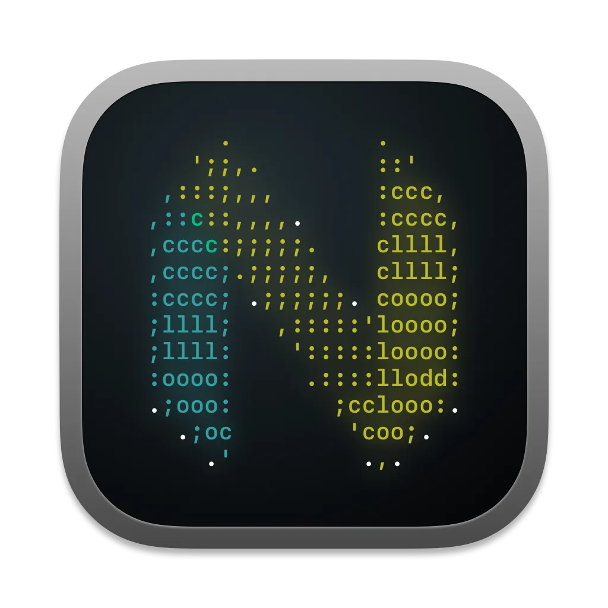

<h1 align="center">Neovim and MacOS Automator Integration</h1>

## Overview
A script to run with MacOS Automator to enable "Always open with"
for file types I want to open in nvim.

I use Wezterm for a terminal, but should be pretty easy to hack it for 
whatever terminal emulator you use.

## Prerequisites:
In order to use as-is, you'll need the following:
- MacOS with Automator (duh?)
- WezTerm installed
- Neovim installed

## Setup / Usage:
**1. Set the following variables in the script**
- **TERM_EXEC** - the path to your wezterm executable
- **NVIM_EXEC** - the path to your nvim executable

**2. Create an Automator applet**
Use the `run shell script` action, pointing at this script.

**3. Associate files/filetypes**
Use normal MacOS Finder interfaces to set "always open with" 
and / or "apply to all" stuffs.

**4. Add an icon to the applet (optional)**
Some users still use the mouse for things and enjoy dropping a file onto an 
icon in their dock. The automator icon is ugly, so I included the icon I use.
> 1. Select the `nvim.icns`, and copy it.  (cmd + c)
> 2. Highlight the applet in Finder and open info (cmd + i)
> 3. Click the current applet icon in the top of the info window, and paste (cmd + v)

## Acknowledgements
Included a MacOS Icon file shared on Reddit as an open download by 
Reddit user [u/danbee](https://www.reddit.com/user/danbee/).

## License
[WTFPL](http://www.wtfpl.net/). Do whatever you want.
